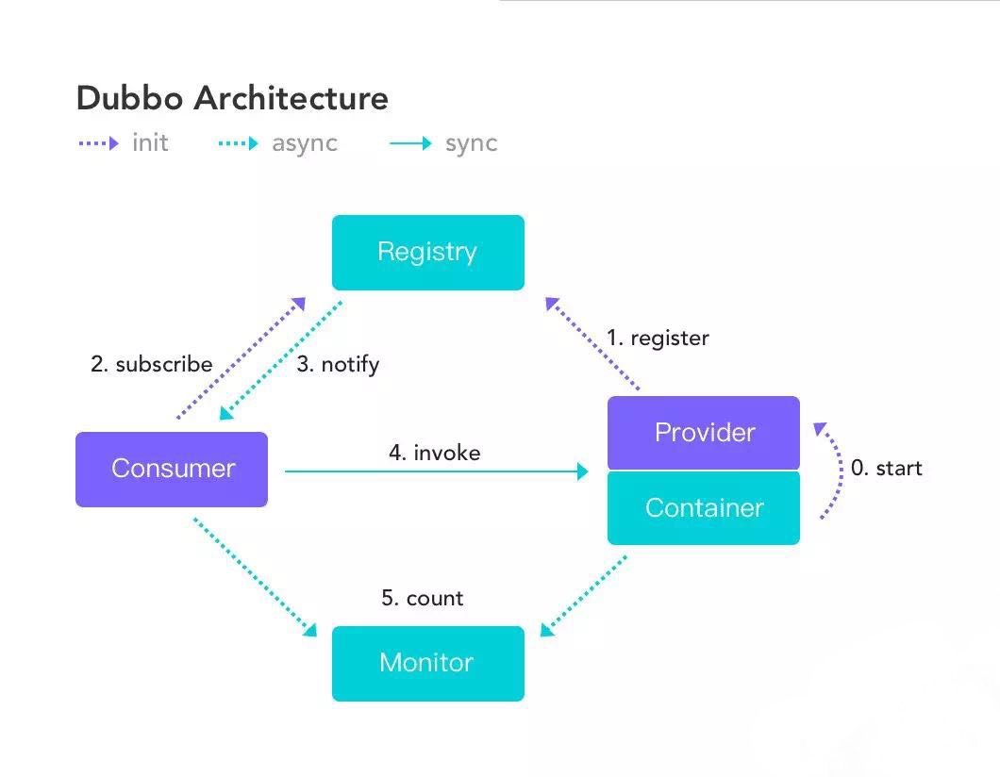

# wenfengSAT-Dubbo

------

**Dubbo |db|**是一个由阿里巴巴开源的、分布式的RPC(Remote Procedure Call Protocol-远程过程调用)和微服务框架，现为Apache顶级项目。

**Dubbo**提供了三个关键功能：基于接口的远程调用，容错与负载均衡，服务自动注册与发现。

对于**Dubbo**的RPC架构，实现一个简单套用的模板，分以下几步实现，持续开发ing...

* 先对Dubbo基础功能做一个整体开发
* 将项目机构分层:api、provider、consumer、web
* 对代码进行一次重构优化

> * dubbo-api:定义API接口
> * dubbo-provider:接口实现
> * dubbo-consumer:接口调用,提供api
> * dubbo-web:可调用dubo-provider接口服务

* 引进kafka、增加Nginx、Zookepper部署方案

* 支付宝扫码支付流程

* 微信扫码支付流程

